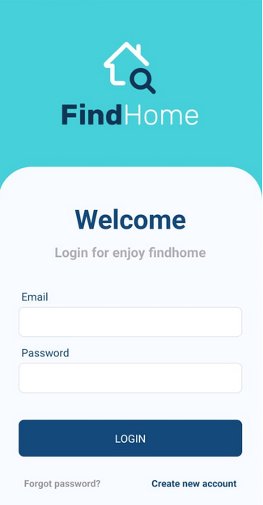
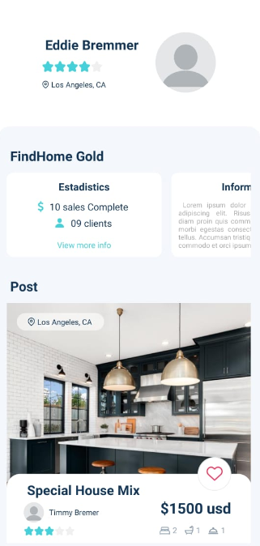
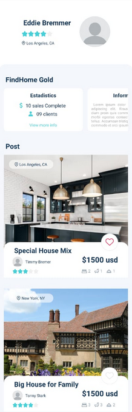

# Aplicativo para aluguel de casas (Estudo)

Projeto de codificação de um aplicativo (React Native) utiliando como modelo um layout já desenvolvido com a ferramenta Figma.

### Prints do aplicativo

(Login)

(Account)

(Account estendida)

### Layout utilizado como exemplo
[https://www.figmacrush.com/figma-rental-mobile-app-template/](https://www.figmacrush.com/figma-rental-mobile-app-template/)
